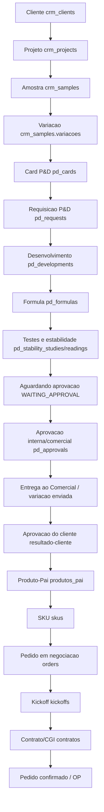

# Auditoria V2 - Fluxo Real

Base: `3eefc93327dad017671763af8ff4aa2734be6922`

## Transicoes principais

| Transicao | Backend | Collection | Status/campo | Side effect |
| --- | --- | --- | --- | --- |
| Cliente criado | `crm_routes.py`, `cadastros_master_routes.py` | `crm_clients` | `stage`, `status_cadastro`, `cli4` | CLI4 sugerido/validado. |
| Projeto criado | `crm_routes.py` | `crm_projects` | `stage` | Vinculo ao cliente. |
| Amostra criada | `crm_routes.py` | `crm_samples` | `stage`, `variacoes` | Pode gerar card P&D. |
| Card P&D sincronizado | `crm_routes.py::_sync_pd_cards_from_crm_stage` | `pd_cards` | `status` | WebSocket `pd_card_updated`. |
| Requisicao P&D | `pd_routes.py` | `pd_requests` | `status` | Desenvolvimento, formulas, testes. |
| Entregar ao Comercial | `pd_routes.transition_status` e `crm_routes.move_pd_card` | `pd_requests`, `pd_cards` | `WAITING_APPROVAL` / `aguardando_aprovacao` | Gate D48h. |
| Resultado do cliente | `POST /crm/samples/{sample_id}/variacoes/{variacao_id}/resultado-cliente` | `crm_samples` | `variacoes.$.resultado`, `status` | Aprova, arquiva ou manda retrabalho para P&D. |
| Produto-Pai | `produtos_routes.py` | `produtos_pai` | `status` | Agrupa apresentacoes/SKUs assim que a amostra/variacao for aprovada. |
| SKU por variacao | `crm_routes.py::_create_sku_from_variacao_v2` | `skus` | `status=ativo`, `pd_concluido=true` | Nasce na aprovacao da amostra/variacao pelo cliente para autopreencher pedido em negociacao. |
| Kickoff | `kickoff_routes.py` | `kickoffs` | `em_preenchimento`, `aguardando_aprovacao`, `aprovado` | Aprova em etapas. |
| Contrato/CGI | `contratos_routes.py` e `orders_routes.py::sign_cgi` | `contratos`, `orders` | `contratos.status=gerado/assinado`; `orders.cgi_status=assinado` | Gate posterior antes de confirmar pedido. |
| Pedido | `orders_routes.py` | `orders` | `rascunho`, `confirmado`, `em_producao`, `concluido` | PDF, confirmacao cliente, aprovacao comercial, OP. |

## Permissoes observadas

- P&D: roles `admin`, `lider_pd`, `formulador`, `qa`, `engenharia_produto`, `vendedor`, `sales_ops`, `sucesso_cliente` variam por acao.
- CAT3: solicitacao por P&D/Comercial; aprovacao/inativacao por `admin`.
- Pedido Direto: valida cliente e SKU no backend.
- Pedido Gerador: no Discovery nao exige `cliente_id`, ponto P0.
